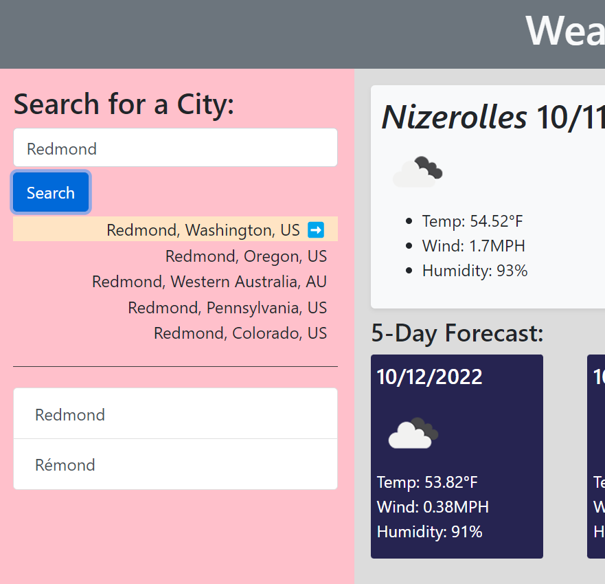
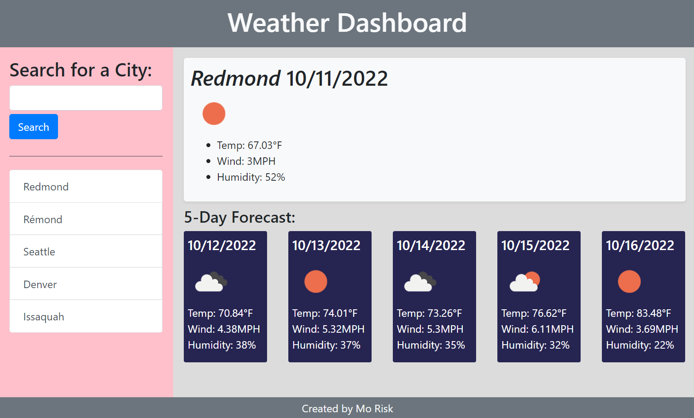
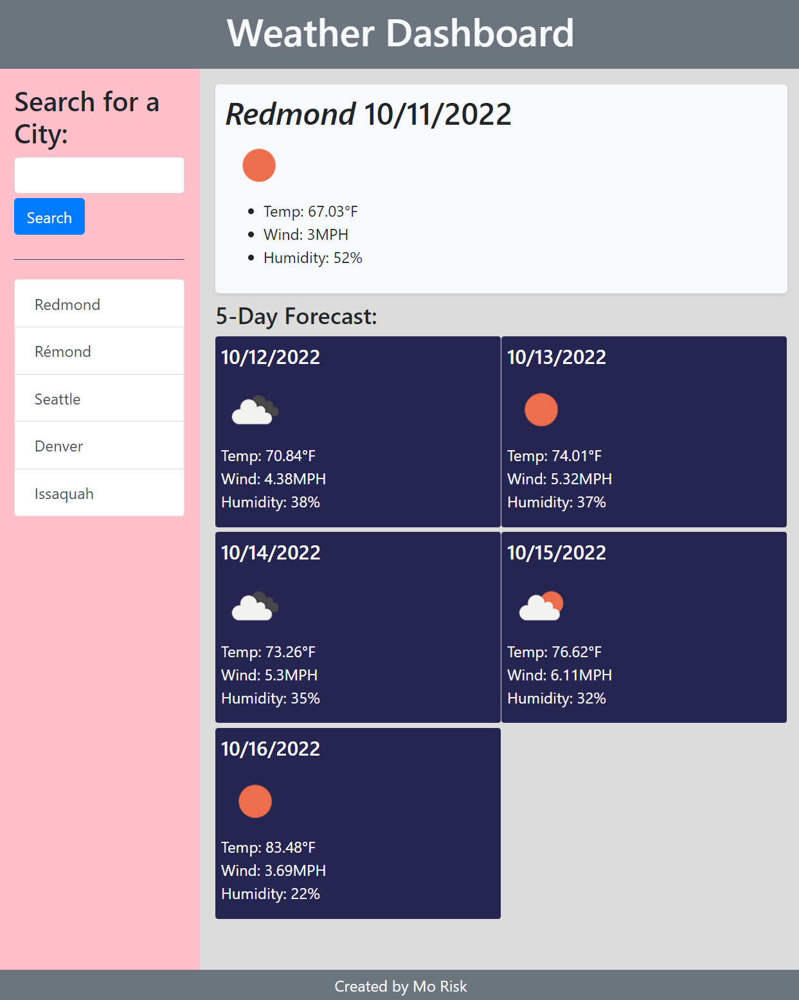
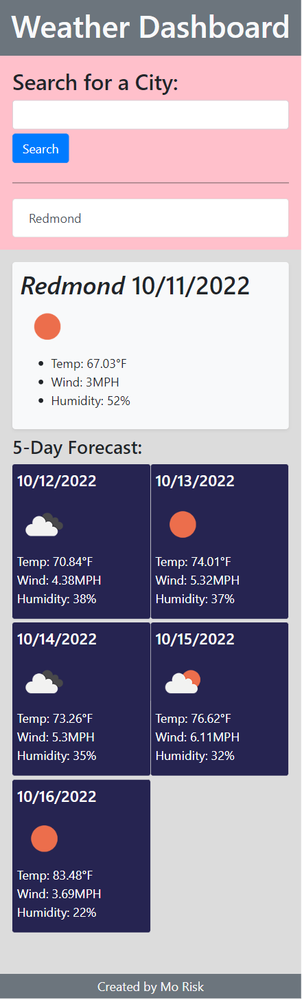

# Weather Dashboard

## Description

This webpage is created to build a weather dashboard by making requests to and retrieving data from openweathermap API. Users can search a city to see the current weather and 5 days forecast. The search history will be stored and shown on the page so that the weather data can be easily retrieved again. 

## Usage

- The URL of the Deployed page:  
https://morisky78.github.io/weather-dashboard/

- The URL of the GitHub repository:  
https://github.com/morisky78/weather-dashboard

### Multiple Search result
When the city name searched by the user has multiple results, the city lists are shown as follows, and you can select one of them.

### Responsive user interface
The screenshots of the page are attached below to show the layout difference in 3 different screen sizes.    
  
 

## Credits

- Convert unix to date string
https://momentjs.com/docs/#/parsing/unix-timestamp-milliseconds/

- OpenWeatherMpa.org : Five day forecast
https://openweathermap.org/forecast5#min

- OpenWeatherMpa.org : Current weather
https://openweathermap.org/current#data

- OpenWeatherMpa.org : Weather condition code
https://openweathermap.org/weather-conditions

- OpenWeatherMpa.org :  gepcode api
https://openweathermap.org/api/geocoding-api

